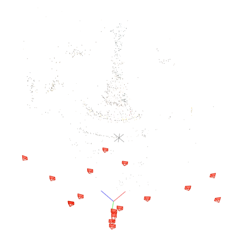
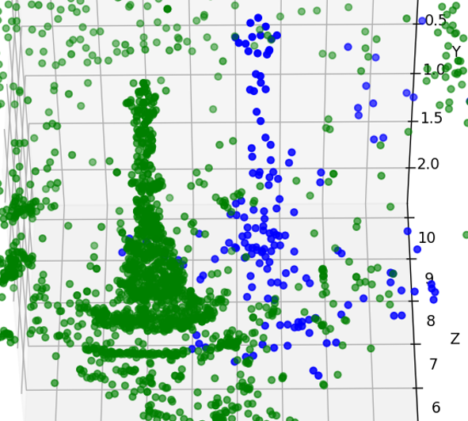

# ComputerVision_3D_Reconstruction

This repository implements a full **Structure from Motion (SfM)** pipeline from scratch using Python. It includes camera calibration, image matching, 3D reconstruction, and a comparison with COLMAP results for benchmarking.

---

## Project Overview

This project demonstrates a **from‑scratch** implementation of several core Structure‑from‑Motion (SfM) techniques:

-**Camera Calibration** using checkerboard patterns  
-**Feature Matching** with SuperGlue (SuperPoint + SuperGlue)  
- **3‑D Reconstruction** pipeline including:  
  - Structure from Disparity (SfD)  
  - Perspective‑n‑Point (PnP)  
  - Triangulation  
  - Bundle Adjustment for global refinement  
- **Image Difference Analysis** to quantify reconstruction quality  
- **COLMAP Comparison** for dense 3‑D benchmarking
---

## Methodology

### 1. Camera Calibration

Use `calibrate.py` to compute the camera intrinsic matrix from `calibration_images/` and undistort the `dataset_images/`.

```bash
python calibrate.py
```
This generates:

intrinsics.npy: Camera intrinsic matrix

Undistorted versions of the dataset images

## Feature Matching

Feature matches between dataset images are required. You can use any method.

In this project, [**SuperGlue**](https://github.com/magicleap/SuperGluePretrainedNetwork) was used for keypoint matching due to its high robustness and accuracy.

Matches are saved and used by the reconstruction pipeline.

---

## 3D Reconstruction

Run `reconstruct.py` to perform the full Structure from Motion pipeline:

```bash
python reconstruct.py
This script includes the following steps:

Relative Pose Estimation between image pairs

Triangulation of 3D points from matched keypoints

PnP Pose Estimation using 2D-3D correspondences

Bundle Adjustment to refine 3D points and camera poses

Image Similarity & Difference Detection between reconstructions


## Comparison with COLMAP

The `colmap_project/` folder contains a setup for using [**COLMAP**](https://colmap.github.io/) to generate a dense 3D reconstruction of the dataset.

Below is a sample visual comparison between the original image, the 3D reconstruction from this project, and the reconstruction from COLMAP:

| Original Image | Our SfM Reconstruction | COLMAP Reconstruction | Comparison |
|----------------|------------------------|------------------------|---------------|
|  |  |  | 

---

## Requirements

- Python 3.8+
- OpenCV
- NumPy
- SciPy
- Matplotlib
- SuperGlue / SuperPoint (external models)

> 🔗 **See the [SuperGlue repository](https://github.com/magicleap/SuperGluePretrainedNetwork)** for model setup and usage instructions.

---


